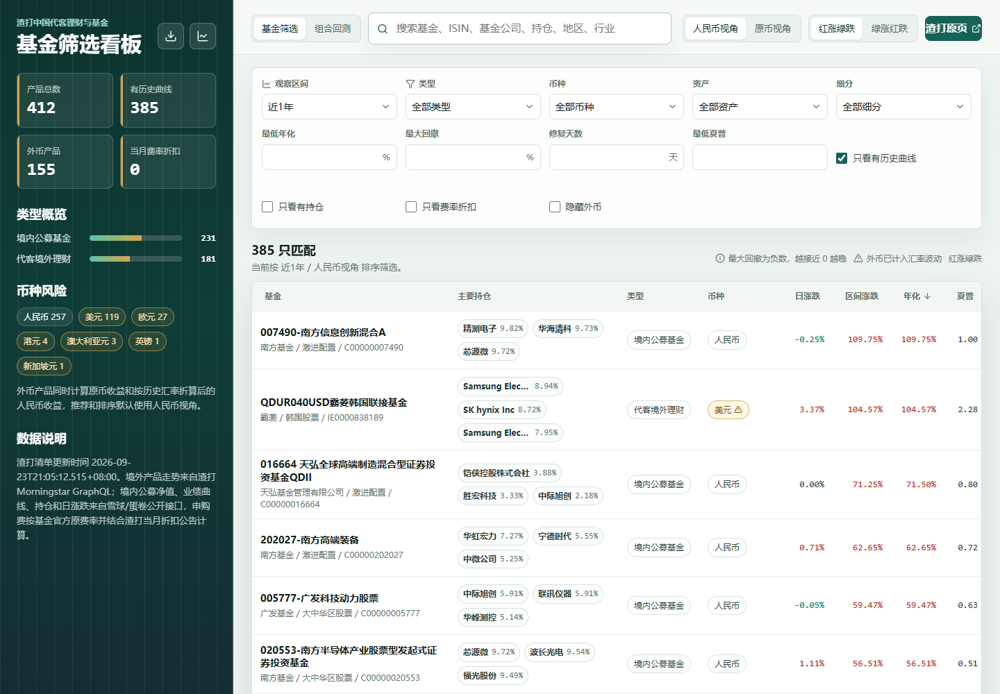

# SC Funds

渣打中国可购基金筛选、持仓穿透、区间收益和组合回测看板。

线上访问：[https://john.js.org/scfunds/](https://john.js.org/scfunds/)

国内访问：[https://scfunds.jozhn.com/](https://scfunds.jozhn.com/)



## 本地运行

```bash
npm ci
npm run update-data
npm run dev
```

开发服务器默认读取 `public/data/funds.json`。

数据按用途拆分，页面加载顺序也据此设计：

- `public/data/funds.json`：基金列表、区间指标、持仓、费率和最近若干天净值，首屏只解析这个文件。
- `public/data/history/<基金>.json`：每只基金的逐日历史净值（约 70KB），打开详情或组合回测时按需加载，前端按会话缓存。

首屏后的数据由 `public/sw.js`（Service Worker）做浏览器侧持久缓存：数据文件先返回缓存、后台静默更新，带 hash 的静态资源永久命中缓存。数据目录可通过 `VITE_DATA_BASE` 指向自己的 CDN。

## 常用命令

```bash
npm run update-data  # 重新抓取基金列表、历史收益、持仓、费率和汇率
npm run lint         # oxlint 检查
npm run build        # 构建静态站点
```

## GitHub Pages

仓库发布到：

```text
https://john.js.org/scfunds/
```

`.github/workflows/pages.yml` 使用 GitHub Pages 官方 Actions 部署静态站点：

- 推送 `main`：使用仓库内已有的 `public/data/` 构建并部署。
- 手动运行 `Build and deploy GitHub Pages`：默认先执行 `npm run update-data`，再构建并部署。

第一次部署前，在 GitHub 仓库 Settings -> Pages 里把 Build and deployment 的 Source 设为 `GitHub Actions`。
